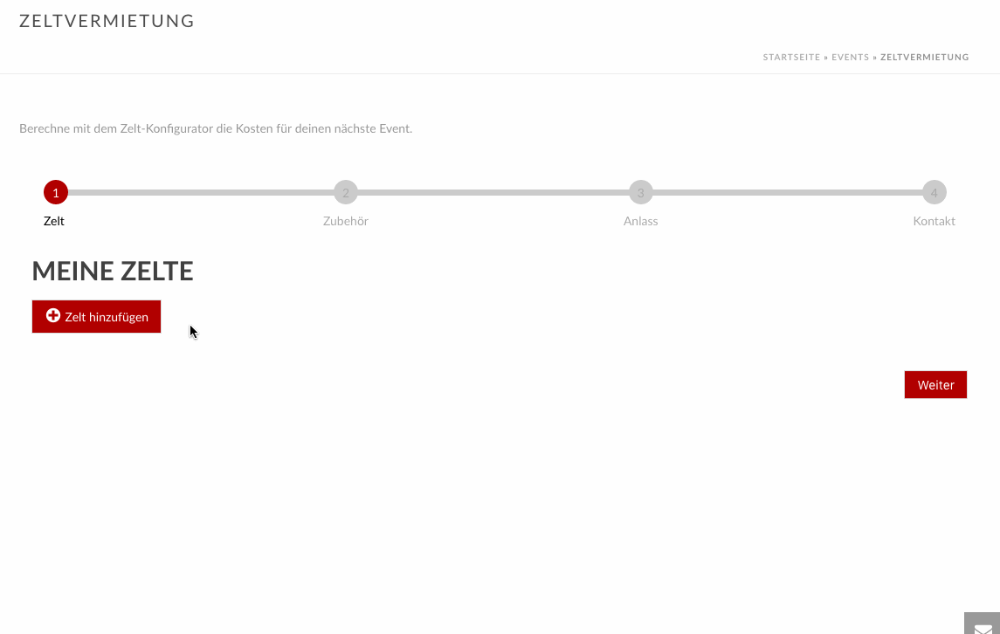

Tentconfigurator
=============

This is a wordpress plugin providing a wizard form build with [knockoutJS](http://knockoutjs.com).

Main features:

- Build with knockoutJS
- Integrates google-api for location-autocompletion
- Integrates google-api to calculate distances
- Responsive

Installation
------------

Just clone this repo into your wordpress plugin directory

    cd wp-content/plugins
    git clone git@github.com:elioschmutz/wp-plugin-tentconfigurator.git

and install it trough the Wordpress Plugin Installer.

Dependencies
--------------------

Make sure, you installed the following packages in your wordpress installation:

 - [WP-Plugin-KnockoutJS](https://github.com/elioschmutz/wp-plugin-knockoutjs)

Contributing
------------

1. Fork it!
2. Create your feature branch: `git checkout -b my-new-feature`
3. Commit your changes: `git commit -m 'Add some feature'`
4. Push to the branch: `git push origin -u my-new-feature`
5. Submit a pull request

Copyright
---------

This package is copyright by elioschmutz

wp-plugin-tentconfigurator is licensed under GNU General Public License, version 2.
